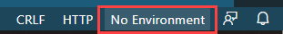

# Dapr APIM sample

This repo contains a sample application that demonstrates the integration of Dapr and Azure API Management (APIM).

## Introduction

APIM has been a PaaS service that was only available on Azure for quite some time. But recently, a new feature was added: the ability to run a self-hosted APIM gateway anywhere you want. This self-hosted gateway needs to connect to an APIM instance in Azure for it to function. This is because all the configuration and monitoring of the APIs that are exposed through the gateway is done in APIM.

The Dapr team has worked on integration of Dapr and the APIM self-hosted gateway. This enables you to run the gateway with a Dapr sidecar and make use of the Dapr building blocks: **service invocation**, **pub/sub** and **bindings**.

The sample application makes use of this feature. The APIM gateway is deployed in a Kubernetes cluster together with a backend service. Both will be deployed with a Dapr sidecar. The backend service will be invoked by the APIM gateway using Dapr building-blocks. The application's architecture is shown in Figure 1:


**Figure 1**: Application architecture

In API management, there is 1 API defined: `eShopAPI`. This API has 2 operations:  

- `/addcustomer`: this operation invokes the `AddCustomer` method on the `CustomerController` of the `CustomerService` using the Dapr service invocation building-block.

- `/customercreated`: this operation publishes a message on the `customer-events` topic using the Dapr pub/sub building-block. The `CustomerCreated` method on the `CustomerController` of the `CustomerService` is subscribed to this topic and will be invoked when a message is sent to the topic. The pub/sub building-block uses the Redis server as message-broker component.

The application is kept as simple as possible in order to focus on the APIM and Dapr concepts. The next paragraphs contain instructions on how to run and test it. Once you have everything up and running, you can start experimenting with adding more functionality. You could for instance add an operation that uses an output-binding to store a customer in the Redis server.

## Prerequisites

- A Kubernetes cluster (the application was created using Docker Desktop with Kubernetes enabled)
- Kubernetes CLI (kubectl)
- Helm
- Access to an Azure subscription
- VS Code
- .NET 5 SDK

## Instructions

Follow the instructions below to deploy, run and test the application.

> The first couple of steps setup the API in APIM. These are one-time initialization steps. Once you have executed them, you can start at [Prepare for deployment in Kubernetes](#prepare-for-deployment-in-kubernetes).

1. Create an Azure API Management instance in your Azure subscription.

### Setup the environment

1. Make a copy the file `src/apim-setup/env-sample.json` and name it `env.json`.

1. Get the `subscription id` of your subscription, the name of the `resource group` in which you have created the API Management instance and the name of the API Management instance. Replace the placeholders for these values in the `env.json` file with the actual values.

1. Open a Powershell window and go to the folder `src/apim-setup`.

1. Run the script `setup-env.ps1`. This script will create an authentication token for calling the APIM management API.

### Import API definitions

1. Open a Powershell window and go to the folder `src/apim-setup`.

1. Run the script `import-api.ps1`. This script wil create the API definition in the APIM instance. See the file `src/apim-setup/eshop-api.yaml` to inspect the definition. It is in Open API format.

1. Run the script `import-global.ps1`. This script will add a rate-limiting policy for all the operations. See the file `src/apim-setup/policies/global.json` to inspect the policy.

1. Run the script `import-addcustomer.ps1`. This script will add the `addcustomer` operation to the API. See the file `src/apim-setup/policies/addcustomer.json` to inspect the policy.

1. Run the script `import-customercreated.ps1`. This script will add the `customercreated` operation to the API. See the file `src/apim-setup/policies/customercreated.json` to inspect the policy.

### Setup the self-hosted APIM gateway

1. Run the script `setup-gateway.ps1`. This script will create the APIM gateway (named `eshop-apim-gateway`) and link this to the `eShopAPI` API.

### Prepare for deployment in Kubernetes

1. Open a Powershell window.

1. If you are revisiting the sample after some time, the APIM Management API token probably has expired. In that case, go to the folder `src/apim-setup` and run the script `setup-env.ps1` to generate a new token.

1. Make sure you have a Kubernetes cluster running in which you can deploy the application. Also make sure the Kubernetes CLI (kubectl) is available.

1. Go to the folder `src/deploy`.

1. Run the script `create-namespace.ps1` to create the namespace `dapr-apim-sample` in the Kubernetes cluster.

1. Run the script `install-redis.ps1` to install a Redis server into the namespace.

1. Run the script `create-gateway-configmap.ps1`. This script will create a config-map containing the URI of the API in APIM. This config-setting is used by the gateway to connect to the APIM instance in Azure.

1. Run the script `create-gateway-key-secret.ps1`. This script will generate a token for communicating with the APIM gateway in Azure. This token is stored in a Kubernetes secret that will be used by the gateway. **The script will generate a token that is valid for 2 days**. After token has expired, you can rerun the script to generate a new token.

### Start the application and APIM Gateway

1. Open a Powershell window and go to the folder `src/deploy`.

1. Run the script `start.ps1`. This script will create the following resources in the Kubernetes cluster:
    - A Dapr configuration used by all the sidecars
    - A pub/sub component that used the Redis server
    - The APIM Gateway
    - The `CustomerService` backend service.
  
### Test the application

1. Install the [REST Client extension for VS Code](https://marketplace.visualstudio.com/items?itemName=humao.rest-client).

1. Create file `.vscode/settings.json` with the following content:

   ```json
    {
      "rest-client.environmentVariables": {
        "local": {
          "AZ_API_SUB_KEY": "<subscripton key>"
        }
      }
    }
   ```

1. Run the script `get-api-subscription-key.ps1`. **CAUTION:** this script will retrieve the subscription-key for your API and show it on the console! Once you see the key, copy it and paste it in the `setting.json` file you've created in the previous step. The settings file will never be pushed to GitHub!

1. Open the file `src/requests/customerservice.http`.

1. Make sure you select the `local` environment for the REST Client. This is necessary so the API subscription key variable can be read from the `settings.json` file. You can select an environment by clicking on the environment selector in the bottom right of the VS Code status-bar (or use the Ctrl-Alt-E shortcut-key). It probably reads `No Environment`:

   

1. Test the application by invoking the requests. You should receive a `200 OK` when executing the `addcustomer` operation. The `customercreated` operation will yield a `204 No Content`.

1. You can inspect the logging of the `CustomerService` container to see that the service is actually being called.

### Stop the application

1. Open a Powershell window and go to the folder `src/deploy`.

1. Run the script `stop.ps1`. This script will remove the application resources from the Kubernetes cluster.

> If you want to remove everything from the cluster, run the script `src/deploy/delete-all.ps1`. This will remove the `dapr-apim-sample` namespace and everything in it (including the configmap, secret and Redis server). The next time you need to restart at [Prepare for deployment in Kubernetes](#Prepare-for-deployment-in-Kubernetes).
